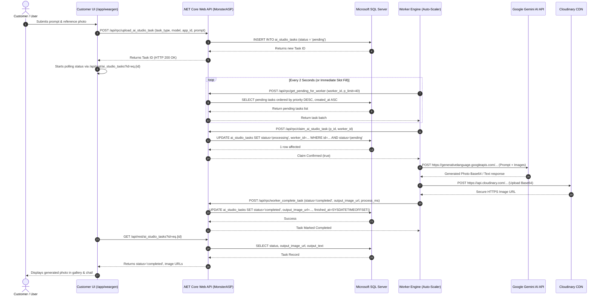
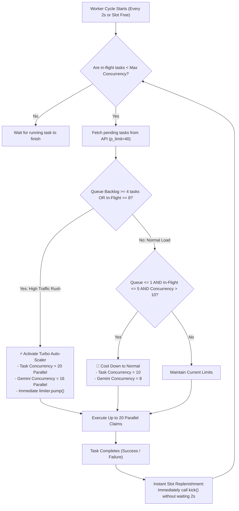
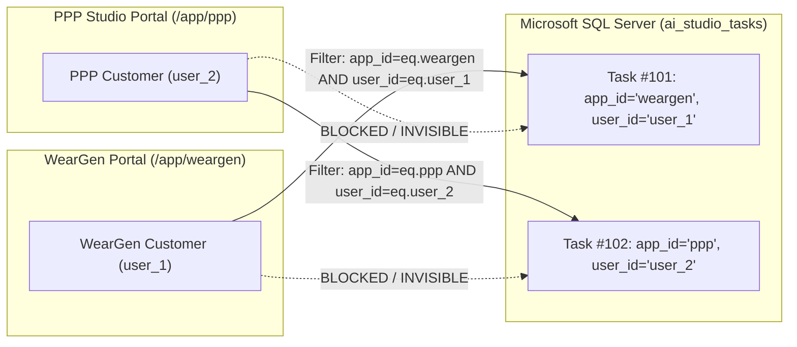

# AI Studio: System Flow & Execution Pipelines

## 1. End-to-End Task Lifecycle

```mermaid
sequenceDiagram
    autonumber
    actor Customer as Customer / User
    participant App as Customer UI (/app/weargen)
    participant API as .NET Core Web API (MonsterASP)
    participant DB as Microsoft SQL Server
    participant Worker as Worker Engine (Auto-Scaler)
    participant Gemini as Google Gemini AI API
    participant Cloud as Cloudinary CDN

    Customer->>App: Submits prompt & reference photo
    App->>API: POST /api/rpc/upload_ai_studio_task (task_type, model, app_id, prompt)
    API->>DB: INSERT INTO ai_studio_tasks (status = 'pending')
    DB-->>API: Returns new Task ID
    API-->>App: Returns Task ID (HTTP 200 OK)
    App->>App: Starts polling status via /api/rest/ai_studio_tasks?id=eq.{id}

    loop Every 2 Seconds (or Immediate Slot Fill)
        Worker->>API: POST /api/rpc/get_pending_for_worker (worker_id, p_limit=40)
        API->>DB: SELECT pending tasks ordered by priority DESC, created_at ASC
        DB-->>API: Return pending tasks list
        API-->>Worker: Return task batch
    end

    Worker->>API: POST /api/rpc/claim_ai_studio_task (p_id, worker_id)
    API->>DB: UPDATE ai_studio_tasks SET status='processing', worker_id=... WHERE id=... AND status='pending'
    DB-->>API: 1 row affected
    API-->>Worker: Claim Confirmed (true)

    Worker->>Gemini: POST https://generativelanguage.googleapis.com/... (Prompt + Images)
    Gemini-->>Worker: Generated Photo Base64 / Text response

    Worker->>Cloud: POST https://api.cloudinary.com/... (Upload Base64)
    Cloud-->>Worker: Secure HTTPS Image URL

    Worker->>API: POST /api/rpc/worker_complete_task (status='completed', output_image_url, process_ms)
    API->>DB: UPDATE ai_studio_tasks SET status='completed', output_image_url=..., finished_at=SYSDATETIMEOFFSET()
    DB-->>API: Success
    API-->>Worker: Task Marked Completed

    App->>API: GET /api/rest/ai_studio_tasks?id=eq.{id}
    API->>DB: SELECT status, output_image_url, output_text
    DB-->>API: Task Record
    API-->>App: Returns status='completed', image URLs
    App-->>Customer: Displays generated photo in gallery & chat!
```

---

## 2. Dynamic Auto-Scaling Turbo Mode Flow

```mermaid
flowchart TD
    Start["Worker Cycle Starts (Every 2s or Slot Free)"] --> CheckSlots{"Are in-flight tasks < Max Concurrency?"}
    CheckSlots -- No --> Wait["Wait for running task to finish"]
    CheckSlots -- Yes --> FetchPending["Fetch pending tasks from API (p_limit=40)"]
    
    FetchPending --> CheckRush{"Queue Backlog >= 4 tasks OR In-Flight >= 8?"}
    
    CheckRush -- Yes: High Traffic Rush --> ScaleUp["⚡ Activate Turbo Auto-Scaler<br/>- Task Concurrency = 20 Parallel<br/>- Gemini Concurrency = 16 Parallel<br/>- Immediate limiter.pump()"]
    CheckRush -- No: Normal Load --> CheckCoolDown{"Queue <= 1 AND In-Flight <= 5 AND Concurrency > 10?"}
    
    CheckCoolDown -- Yes --> ScaleDown["🌿 Cool Down to Normal<br/>- Task Concurrency = 10<br/>- Gemini Concurrency = 8"]
    CheckCoolDown -- No --> KeepStandard["Maintain Current Limits"]
    
    ScaleUp --> ProcessBatch["Execute Up to 20 Parallel Claims"]
    ScaleDown --> ProcessBatch
    KeepStandard --> ProcessBatch
    
    ProcessBatch --> TaskComplete["Task Completes (Success / Failure)"]
    TaskComplete --> InstantSlot["Instant Slot Replenishment:<br/>Immediately call kick() without waiting 2s"]
    InstantSlot --> CheckSlots
```

---

## 3. Multi-App Customer Data Isolation Flow

```mermaid
graph LR
    subgraph WearGenApp ["WearGen Portal (/app/weargen)"]
        WUser["WearGen Customer (user_1)"]
    end

    subgraph PPPApp ["PPP Studio Portal (/app/ppp)"]
        PUser["PPP Customer (user_2)"]
    end

    subgraph Database ["Microsoft SQL Server (ai_studio_tasks)"]
        WRow["Task #101: app_id='weargen', user_id='user_1'"]
        PRow["Task #102: app_id='ppp', user_id='user_2'"]
    end

    WUser -->|Filter: app_id=eq.weargen AND user_id=eq.user_1| WRow
    PUser -->|Filter: app_id=eq.ppp AND user_id=eq.user_2| PRow

    WUser -.->|BLOCKED / INVISIBLE| PRow
    PUser -.->|BLOCKED / INVISIBLE| WRow
```
